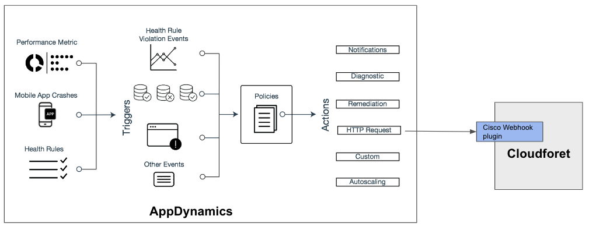

# plugin-cisco-appdynamics-mon-webhook
webhook from Cisco AppDynamics

# Data Model

https://docs.appdynamics.com/appd/23.x/latest/en/appdynamics-essentials/alert-and-respond/actions/http-request-actions-and-templates

## HTTP Request Template (Payload)

~~~
{
  "account_name": "${account.name}",
  "policy_name": "${policy.name}",
  "events": [
  #foreach( $event in $fullEventList )
  {
  "guid": "$event.guid",
  "event_id": "${latestEvent.id}",
  "application_name": "${latestEvent.application.name}",
  "eventTypeKey": "$event.eventTypeKey",
  "severity": "$event.severity",
  "displayName": "$event.displayName",
  "summaryMessage": "$event.summaryMessage",
  "eventTime": "${event.eventTime}",
  "deepLink": "${event.deepLink}"
  }#if( $foreach.hasNext ),#end
  #end
  ],
  "topSeverity": "${topSeverity}",
  "controllerUrl": "${controllerUrl}",
  "action_name": "${action.name}"
}
~~~

## AppDynamics to Cloudforet

Free Trial of AppDynamics
https://www.appdynamics.com/free-trial/

Webhook notification:

~~~
{
            "account_name": "MY_APPD_SAAS",
            "policy_name": "Tomcat Server alert",
            "events": [
                {
                    "guid": "aaaaaaaa",
                    "event_id": "1234",
                    "application_name": "MyApp",
                    "severity": "ERROR",
                    "displayName": "Ongoing Critical Health Rule Violation",
                    "summaryMessage": "AppDynamics has detected a problem with Business Transaction <b>/</b>.
                         <b>Business Transaction Health</b> continues to violate with <b>critical</b>. 
                        All of the following conditions were found to be violating For Application <b>MyApp</b>: 
                        1) Calls per Minute Condition <b>Calls per Minute's</b> value <b>89072.00</b>
                        was <b>greater than</b> the threshold <b>50.00</b> for the last <b>2</b> minutes. ",
                    "eventTypeKey": "Health Rule",
                    "eventTime": "Mon Mar 13 08:57:55 UTC 2023",
                    "deepLink": "https://MY_APPD_SAAS.saas.appdynamics.com/#location=
                        APP_EVENT_VIEWER_MODAL&eventSummary=31062509&application=108979",
                },
                {
                    "guid": "bbbbbbbbbb",
                    "severity": "WARN",
                    "event_id": "1234",
                    "application_name": "MyApp",
                    "displayName": "Ongoing Critical Health Rule Violation",
                    "summaryMessage": "AppDynamics has detected a problem with Business Transaction
                        <b>/manager/WEB-INF</b>. <b>Business Transaction Health</b> continues to violate with
                        <b>critical</b>. All of the following conditions were found to be violating 
                        For Application <b>MyApp</b>: 
                        1) Calls per Minute Condition <b>Calls per Minute's</b> value <b>89070.00</b>
                        was <b>greater than</b> the threshold <b>50.00</b> for the last <b>2</b> minutes. ",
                    "eventTypeKey": "Health Rule",
                    "eventTime": "Mon Mar 13 08:57:55 UTC 2023",
                    "deepLink": "https://MY_APPD_SAAS.saas.appdynamics.com/#location=APP_EVENT_VIEWER_MODAL&
                    eventSummary=31062508&application=108979",
                },
            ],
            "topSeverity": "ERROR",
            "controllerUrl": "https://MY_APPD_SAAS.saas.appdynamics.com",
            "action_name": "spaceone-dev-test",
        }

~~~

| Field 	| Description |
| ---   	| ---     |
| account_name		| AppDynamics Account name |
| events       | List of Alert events      |
| ...  	| ... , ... , ...    |

## Event key criteria

* Unique key for related events

## monitoring.Event Data Map
| Field		| Type | Description	| Example	|
| ---      | ---     | ---           | ---           |
| event_key | str | events[].? | ? |
| event_type |  str  | RECOVERY , ALERT based on raw_data.incident.state | RECOVERY	|
| title | str	| events[].displayName	| Ongoing Critical Health Rule Violation	|
| description | str | events[].summaryMessage	| AppDynamics has detected ...		|
| severity | str  | events[].severity | ALERT	|
| resource | dict | ...		| N/A	|
| addtional_info | dict | ... 	| {"application": "MyApp", "url" "https://...." } |
| occured_at | datetime | events[].eventTime | "2021-08-23T06:47:32.753Z" |

# Reference

https://docs.appdynamics.com/appd/23.x/latest/en/appdynamics-essentials/alert-and-respond/actions/predefined-templating-variables
