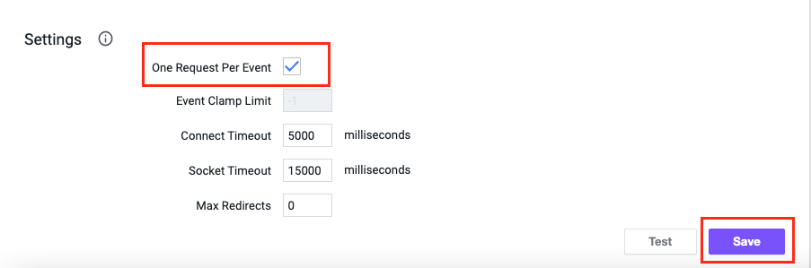

# Overview

Cloudforet supports a webhook integration with AppDynamics.

# In Cloudforet

1. Go to the ***Project*** menu and select the project which will be integrated with AppDynamics.
2. On the ***Alert*** sub menu:
* Select ***Webhook*** menu
* Click ***Add*** button
3. Select ***Cisco AppDynamics*** and update ***Name***
4. Remember ***Webhook URL***

# In AppDynamics

1. Go to the ***Alert & Respond*** tab, then click ***HTTP Request Templates*** on the left menu and
add a new template by clicking ***New***.

2. Give the template a ***Name*** (like "Cloudforet Integration API").

3. In the ***Request URL*** section, change ***Method*** to POST and set ***Raw URL*** which is ***Webhook URL***
in a previous section.

4. In the ***Payload*** section, set the ***MIME Type*** to ***application/json***, then copy and paste
the following in to the text area:

~~~
{
"event_name": "${latestEvent.displayName}",
"event_guid": "${latestEvent.guid}",
"event_id": "${latestEvent.id}",
"policy": "${policy.name}",
"event_time": "${latestEvent.eventTime}",
"app_id": "${latestEvent.application.id}",
"app_name": "${latestEvent.application.name}",
"event_message": "${latestEvent.eventMessage}",
"severity": "${latestEvent.severity}",
"event_deep_link": "${latestEvent.deepLink}",
"controller_url": "${controllerUrl}",
"node_id": "${latestEvent.node.id}",
"node_name": "${latestEvent.node.name}",
"summary": "${latestEvent.summaryMessage}",
"event_type": "${latestEvent.eventType}",
"tier_id": "${latestEvent.tier.id}",
"tier_name": "${latestEvent.tier.name}"
#if(${latestEvent.healthRuleEvent} == true)
,"health_rule_id": "${latestEvent.healthRule.id}",
"health_rule_name": "${latestEvent.healthRule.name}",
"incident_id": "${latestEvent.incident.id}",
"incident_name": "${latestEvent.incident.name}"
#end
}
~~~

5. In the ***Response Handling Criteria*** section, click ***+ Add Success Criteria*** and do the following:
* Select ***200*** as ***Status Code***.

6. In the ***Settings*** section, select the ***One Request Per Event*** option.

7. Click ***Save***.

